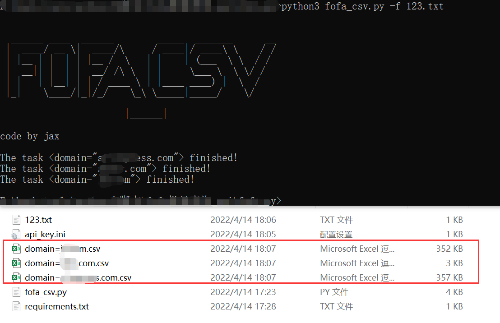

# FOFA_CSV
FOFA批量查询目标并导出CSV文件

# 使用说明
```
FOFA批量查询导出CSV文件 

请先新建api_key.ini文件并写入api key如：email=xxx&key=xxx

  -h, --help            show this help message and exit
  -s STR, --str STR     the search condition like: domain=xx.com
  -f FILE, --file FILE  存放查询语句的文件，一行一条查询语句
```
## Example
```
python3 fofa_csv.py -f 123.txt
```


